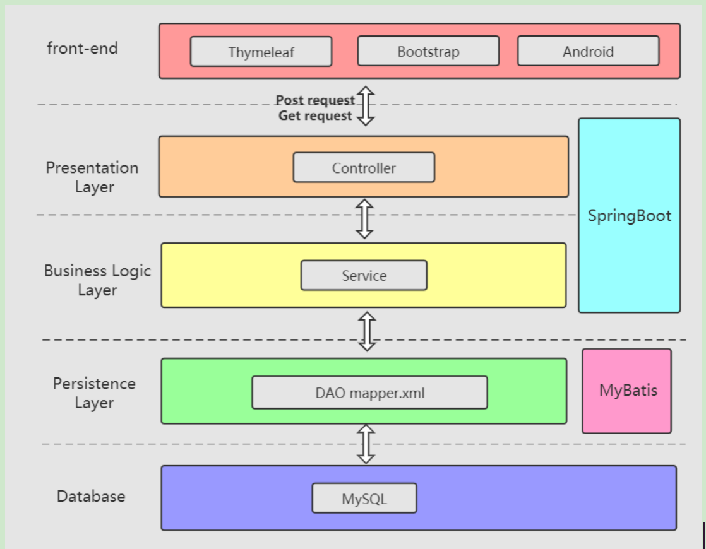

# StudentMangementSystem-Web

# 1 Requirements

  Students and administrators log in and enter the system. They will respectively enter the student interface and administrator interface. Students can view and modify personal information, but the student ID is refused to be modified, and they can also apply for leave. The administrator can conduct comprehensive management of students, including viewing all students and thinformation, modifying students’ basic information, but the studentID is refused to be modified, adding new students, deleting students, viewing all students’ attendance information and approving student leave application.

# 2Module Description

## 2.1 Login Module 

  This module provides the functionality of login process. If correct, an interface will appear according to the user type. if incorrect, proper error message will be displayed. 

## 2.2 Admin Home Module 

  This module provides the functionalities of viewing all students’ basic information and leave information, adding new students, modifying student basic information and deleting students. While modifying student basic information, administrators cannot modify studentID which is the fixed information and administrator cannot leave any information blank or type error before clicking the submit button, otherwise it will appear a reminder message. If administrator delete a student, the student leave information will also be deleted in database. While approving a student leave, administrator need to check carefully and can choose to agree or reject the leave application.

## 2.3 Student Home Module

  This module provides the functionalities of viewing and modifying his/her basic information and asking for a leave. While modifying his/her basic information, he/she cannot modify studentID which is the fixed information and he/she cannot leave any information blank or type error before clicking the submit button, otherwise it will appear a reminder message and failed to submit. While asking a leave, studentID field will appear but cannot be edited and if other leave information fields incomplete, it will appear a reminder message to make sure leave necessary information be filled in. After click the submit button, then he/she can wait for the administrator’s check.

# 3 System Architecture Design

